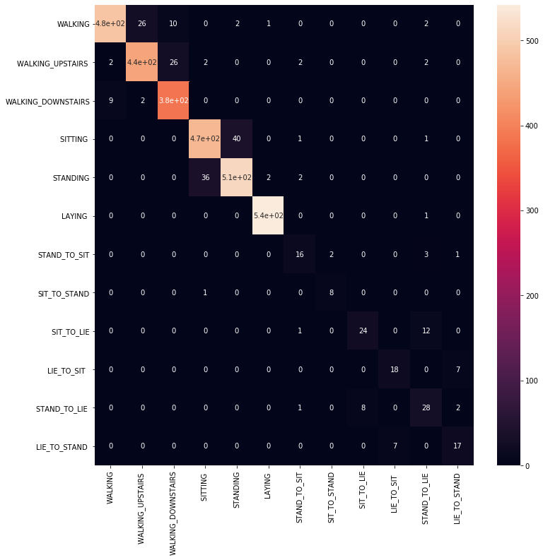
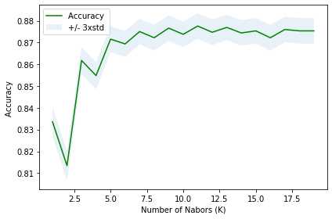
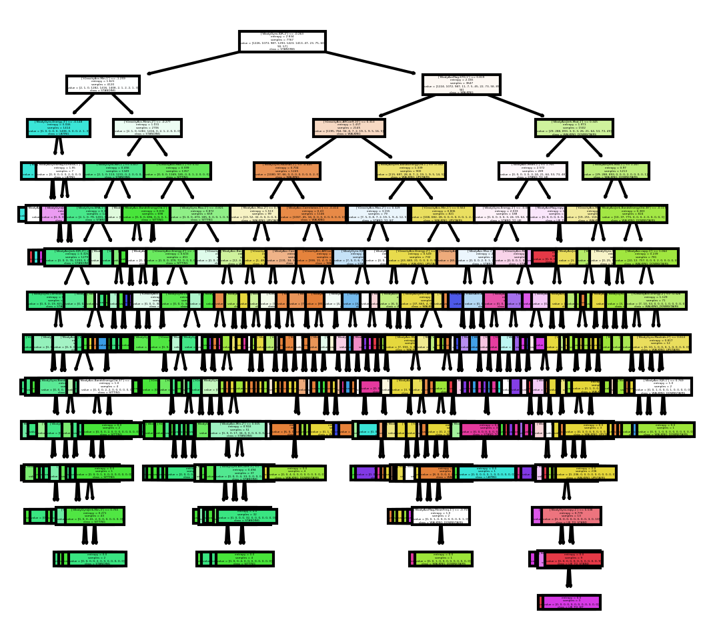

## Smart Phone Based Human Activity Recognition
In this project,I explored this [dataset](http://archive.ics.uci.edu/ml/datasets/Smartphone-Based+Recognition+of+Human+Activities+and+Postural+Transitions). This is basically a
classification problem. I have tried various classical machine learning models like SVM, K-NN, Desicion tree and logistic regressionto get state-of-the-art accuracy.Finally I have also used deep learning models like multilayer perceptron and 1D conv-net. Uniqueness of the datset set is that it has 512 features that is the feature space has 512 dimensions. 

# deep-learning model

# classical machine-leaning models

